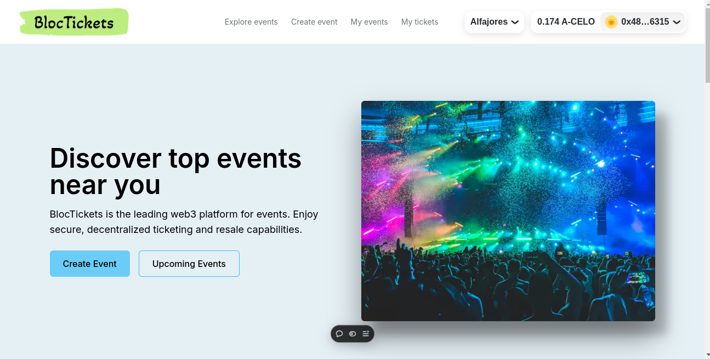
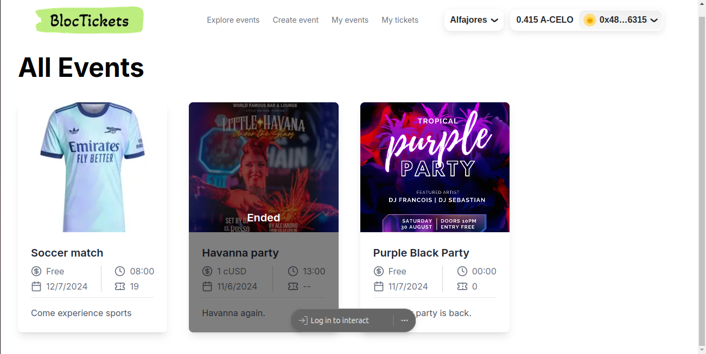
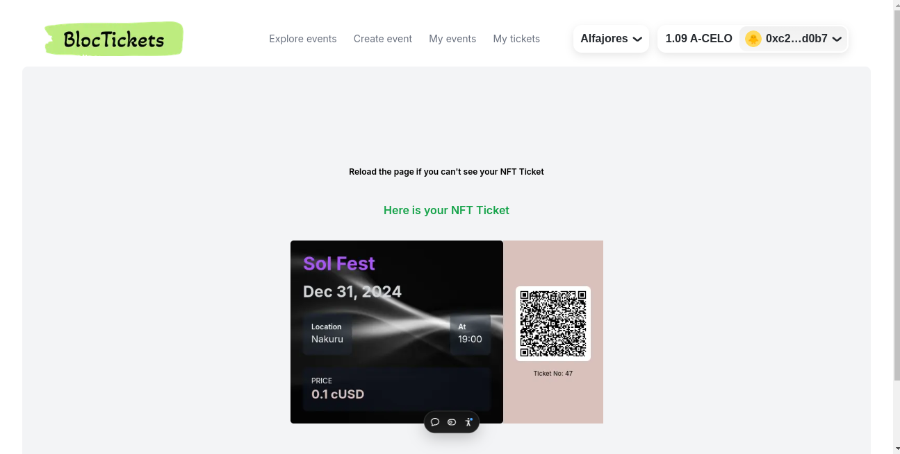

<!-- TITLE -->
<p align="center">


  <p align="center">Web3 platform for events</p>
</p>

------

<div align="center"> <table> <tr> <td align="center">  </td> <td align="center">  </td> </tr> <tr> <td align="center">  </td> <td align="center">  </td> </tr> </table> </div>

------

<details>
<summary> Table of Contents</summary>

- [About the Project](#about-the-project)
- [Installation and Setup](#setup-guide)
- [Demo](#demo)

</details>

## About the Project

**Summary**: BlocTickets is a blockchain-based platform where users can create events and buy NFT tickets, tackling ticket scalping and enhancing trust. 

**Problem Statement**: The traditional event ticketing industry faces numerous challenges, including ticket scalping, fraud, and lack of transparency. These issues undermine trust and can result in significant financial losses for both event organizers and attendees. Additionally, there is often no reliable way to verify the authenticity of an event, leaving buyers unsure of the legitimacy of the events they plan to attend.

**Solution**: BlocTickets offers a blockchain-based platform where users can create events and purchase tickets that are issued as Non-Fungible Tokens (NFTs). This innovative approach ensures that each ticket is unique, verifiable, and secure, addressing the problems of ticket scalping and fraud. By recording transactions on the blockchain, BlocTickets provides a transparent and immutable record of ticket ownership and event details.

### Objectives
- **Eliminate Ticket Scalping and Fraud**: Implement blockchain technology to issue tickets as NFTs, ensuring their authenticity and preventing duplication or counterfeit tickets.
- **Enhance Trust and Transparency**: Provide a transparent platform where all transactions and ticket ownership are recorded on the blockchain, fostering trust among users.
- **Simplify Event Creation and Management**: Offer a user-friendly interface for event organizers to create and manage their events, streamlining the process of selling tickets.

### Scope
- **Event Creation and Management**: Users can create, manage, and promote their events on the BlocTickets platform. Event organizers will have access to tools for tracking ticket sales and managing attendees.
- **NFT Ticketing System**: All tickets will be issued as NFTs, providing a secure and verifiable method of ticket distribution. This system will prevent ticket scalping and fraud by ensuring each ticket is unique and traceable.
- **Blockchain-Based Transactions**: All ticket sales and transfers will be recorded on the blockchain, ensuring transparency and immutability of all transactions.
- **User-Friendly Interface**: The platform will be designed with a focus on usability, ensuring a seamless experience for both event organizers and attendees.


## Installation and Setup

### Prerequisites
Ensure you have **Node.js** installed.

### Steps
1. Clone the repository:
   ```bash
   git clone https://github.com/jeffIshmael/web3Tickets
   cd web3Tickets/frontend
   ```
2. Install dependencies:

    ```bash
    pnpm install
    ```

3. Run the application:

    ```bash
    npm run dev
    ```

## Demo
Create events and buy NFT tickets in our website [Live link](https://bloc-tickets.vercel.app/)

For more information, visit our [website](https://bloc-tickets.vercel.app/) or contact support at [support@bloctickets.com](mailto:jeffianmuchiri24@gmail.com).
------

<p align="right">(<a href="#top">back to top</a>)</p>
